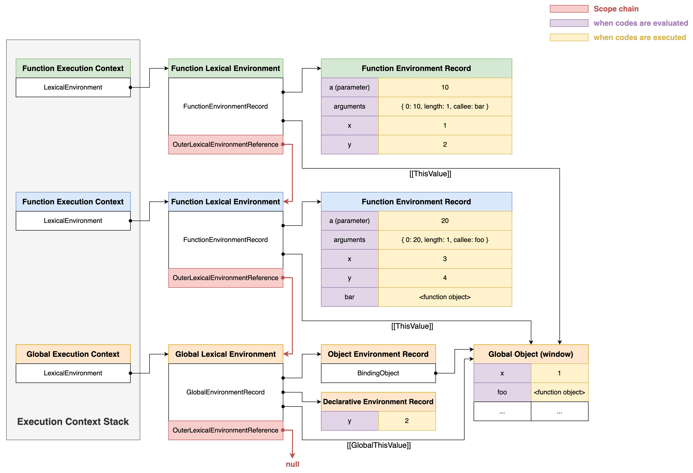

# Execution Context

## Summary

- 실행 컨텍스트 : 소스코드를 평가하고 실행할 때 실행 결과를 관리하기 위한 영역
  - 실행 컨텍스트 = 렉시컬 환경 + 실행 컨텍스트 스택
  - 렉시컬 환경 : 식별자, 식별자에 바인딩된 값, 스코프를 관리하는 자료구조
  - 실행 컨텍스트 스택 : 코드의 실행 순서를 관리하는 스택 자료구조
- 실행 컨텍스트와 스코프, 스코프 체인과의 관계
  - 실행 컨텍스트의 렉시컬 환경에는 외부 렉시컬 환경의 참조가 저장되어 있다.
  - 외부 렉시컬 환경의 참조는 현재 평가 중인 소스코드를 포함하는 외부 소스코드의 렉시컬 환경, 즉 상위 스코프를 가리킨다.
  - 외부 렉시컬 환경의 참조들이 단방향 링크드 리스트로 연결되어 스코프 체인을 이룬다.
  - 전역 렉시컬 환경은 외부 렉시컬 환경의 참조가 `null`이므로, 스코프 체인의 최상단에 위치한다.
- 실행 컨텍스트와 식별자와의 관계
  - 식별자에 접근할 때, 해당 식별자가 선언되었는지 확인하는 과정이 필요하다.
  - 현재 실행 컨텍스트의 렉시컬 환경에 저장된 환경 레코드에서 선언된 식별자들을 찾을 수 있다.
  - 현재 실행 컨텍스트의 환경 레코드에서 식별자를 찾지 못하면, 외부 렉시컬 환경의 참조를 따라(or 스코프 체인을 따라) 상위 렉시컬 환경(or 상위 스코프)의 환경 레코드로 검색을 이어나간다.
  - 전역 환경 레코드에서도 식별자를 찾지 못하면 전역 변수로도 선언되지 않은 것이므로 식별자를 찾지 못하고 종료된다.
- 실행 컨텍스트와 호이스팅과의 관계
  - `var` keyword로 선언된 변수
    - `var` 키워드로 선언된 변수는 평가될 때 현재 실행 컨텍스트의 렉시컬 환경에 저장된 환경 레코드에 변수 식별자가 key로 등록되고 `undefined`로 초기화된다.
    - 코드 실행 단계에서 변수 선언 이전에 변수 식별자에 접근하면 환경 레코드에서 `undefined`로 초기화된 식별자를 찾을 수 있으므로 참조할 수 있다.
  - 함수 선언문으로 정의한 함수
    - 함수 선언문으로 정의한 함수가 평가될 때 함수 이름과 동일한 이름의 식별자를 환경 레코드에 key로 등록하고 함수 객체를 즉시 할당한다.
    - 코드 실행 단계에서 함수 정의 이전에 함수를 호출하면 환경 레코드에 등록된 식별자 key를 찾을 수 있으므로 함수를 호출할 수 있다.
- 실행 컨텍스트와 `this`의 관계
  - 렉시컬 환경의 환경 레코드의 `this`는 전역 환경 레코드와 함수 환경 레코드에만 존재한다.
  - 전역 환경 레코드에서는 `[[GlobalThisValue]]` 내부 슬롯에 객체 환경 레코드에 정의된 `BindingObject`가 참조하는 전역 객체가 바인딩된다.
  - 함수 환경 레코드에서는 `[[ThisValue]]` 내부 슬롯에 함수 호출 방식에 따라 다른 객체가 바인딩된다.
- 전역 객체에 정의된 property와 method들을 전역 객체 식별자 없이 참조할 수 있는 이유
  - 전역 렉시컬 환경의 전역 환경 레코드에서 객체 환경 레코드에 정의된 `BindingObject`가 전역 객체를 참조하고 있음
  - 전역 객체 식별자 없이 전역 객체의 property와 method를 참조하면 전역 실행 컨텍스트의 전역 렉시컬 환경에서 전역 환경 레코드에 정의된 `BindingObject`를 통해 전역 객체에 접근할 수 있음

## Source Code Type

- Source code type에 따라 *실행 컨텍스트*를 생성하는 과정과 관리 내용이 달라진다.
- Source code의 4가지 type
  - 전역 코드 : 전역에 존재하는 소스코드
    1. 전역 scope 생성
    2. `var` keyword로 선언된 전역 변수와 함수 선언문으로 정의된 전역 함수를 전역 객체에 binding
    3. 전역 코드가 평가된 후 _전역 실행 컨텍스트_ 생성
  - 함수 코드 : 함수 내부에 존재하는 소스코드
    1. 지역 scope 생성
    2. 지역 변수, 매개변수, `arguments` 객체 관리
    3. 지역 스코프를 전역 스코프에서 시작하는 스코프 체인에 연결
    4. 함수 코드가 평가된 후 _함수 실행 컨텍스트_ 생성
  - eval 코드 : eval 함수로 실행되는 소스코드
    1. Strict mode에서 독자 scope 생성
    2. eval 코드가 실행되면 _eval 실행 컨텍스트_ 생성
  - 모듈 코드 : 모듈 내부에 존재하는 소스코드
    1. 모듈별로 독립적인 module scope 생성
    2. 모듈 코드가 평가되면 _모듈 실행 컨텍스트_ 생성

## 소스코드를 평가하고 실행하는 과정

- 모든 소스코드는 평가와 실행 2단계에 걸쳐 실행된다.
  - 소스코드 평가 (선언문)
  - 소스코드 실행 (선언문 이외의 문)
- 실행 과정
  1. 소스코드 평가
     1. 실행 컨텍스트 생성
     2. 변수, 함수 등 선언문 우선 실행
     3. 식별자를 실행 컨텍스트가 관리하는 스코프에 등록
  2. 소스코드 실행 (runtime)
     1. 변수 또는 함수가 선언되었는지 확인 -> 실행 컨텍스트가 관리하는 스코프에서 검색
     2. 실행 컨텍스트가 관리하는 스코프에 등록되어 있다면 실행
     3. 변수 할당문이 실행되었다면, 할당 결과를 실행 컨텍스트에 등록해서 관리

## 실행 컨텍스트

- 소스코드를 실행하는 데 필요한 환경을 제공하고 코드의 실행 결과를 관리하는 영역
  - **식별자를 스코프 별로 구분**해서 등록하고 상태 변화 관리
  - **스코프 체인**을 형성하고, 체인을 따라 식별자 검색
  - 실행 중인 코드의 **실행 순서 변경 및 회귀**
- Scope와 코드 실행 순서 관리를 구현한다.
  - Scope 및 식별자는 **렉시컬 환경**으로 관리
  - 코드 실행 순서는 실행 **컨텍스트 스택**으로 관리

### 실행 컨텍스트 스택

- 실행 컨텍스트 스택은 **코드 실행 순서**를 관리한다.
- 생성된 실행 컨텍스트들을 **Stack 자료구조**로 관리된다.
- Stack의 **가장 위에 있는 실행 컨텍스트가 현재 실행되고 있는 실행 컨텍스트**이다.

```js
// 1. 전역 변수 평가
// 4. 전역 변수 선언문 실행 및 값 할당
const x = 1;

// 2. 전역 함수 평가
function foo() {
  // 6. 지역 변수 평가
  // 8. 지역 변수 선언문 실행 및 값 할당
  const y = 2;

  // 7. 중첩 함수 평가
  function bar() {
    // 10. 지역 변수 평가
    // 11. 지역 변수 선언문 실행 및 값 할당
    const z = 3;

    // 12. `x + y + z`문 평가된 값이 인수로 전달되며 `console.log()` 함수 실행
    console.log(x + y + z);
  }
  bar(); // 9. 중첩 함수 실행
}
foo(); // 5. 전역 함수 실행
```

1. 전역 코드 평가 및 실행
   - **전역 실행 컨텍스트**를 생성하고 실행 컨텍스트 스택에 push
   - 평가 : 전역 변수 `x`와 전역 함수 `foo`가 평가되어 *전역 실행 컨텍스트*에 등록
   - 실행 : 전역 변수 `x`에 `1`이 할당되고 전역 함수 `foo` 호출
2. `foo` 함수 코드 평가 및 실행
   - `foo`가 호출되며 제어권이 전역에서 `foo` 함수 내부로 이동
   - **foo 함수 실행 컨텍스트**를 생성하고 실행 컨텍스트 스택에 push
   - 평가 : 지역 변수 `y`와 중첩 함수 `bar`가 평가되어 *foo 함수 실행 컨텍스트*에 등록
   - 실행 : 지역 변수 `y`에 `2`가 할당되고 중첩 함수 `bar` 호출
3. `bar` 함수 코드 평가 및 실행
   - `bar`가 호출되며 제어권이 `foo` 함수 내부에서 `bar` 함수 내부로 이동
   - **bar 함수 실행 컨텍스트**를 생성하고 실행 컨텍스트 스택에 push
   - 평가 : 지역 변수 `z`가 평가되어 *bar 함수 실행 컨텍스트*에 등록
   - 실행 : 지역 변수 `z`에 `3`이 할당되고 `console.log()` method 호출
4. `bar` 함수 종료
   - `bar` 함수가 종료되며 제어권이 다시 `foo` 함수로 이동
   - **bar 함수 실행 컨텍스트**를 실행 컨텍스트 스택에서 pop한 뒤 종료
5. `foo` 함수 종료
   - `foo` 함수가 종료되며 제어권이 다시 전역 코드로 이동
   - **foo 함수 실행 컨텍스트**를 실행 컨텍스트 스택에서 pop한 뒤 종료
6. 전역 코드 종료
   - 전역에 실행할 코드가 남아있지 않으면 **전역 실행 컨텍스트**를 실행 컨텍스트 스택에서 pop

### 렉시컬 환경 (Lexical Environment)

- 실행 컨텍스트의 렉시컬 환경은 **식별자와 스코프**를 관리하는 _렉시컬 스코프의 실체_
- 렉시컬 환경은 실행 컨텍스트를 구성하는 **컴포넌트**이다.
- 식별자, 식별자에 바인딩된 값, 상위 스코프에 대한 참조를 기록하는 자료구조이다.
  - Execution Context
    - Lexical Environment
      - Environment Record : 식별자 및 식별자에 바인딩된 값 관리
      - Outer Lexical Environment Reference : 스코프 관리
- 렉시컬 환경 구조 상세
  - Execution Context
    - Lexical Environment
      - Environment Record : 식별자를 등록하고 바인딩된 값을 관리하는 저장소
        - 전역 코드에서는 'Global Environment Record' 생성
          - Object Environment Record
            - **식별자를 검색할 때** 객체 환경 레코드에서 찾는다.
            - `BindingObject` 객체와 연결된다.
            - 전역 객체의 property 및 method들은 `BindingObject`를 통해서 전역 객체에 정의된다.
              - **`var` keyword로 선언한 전역 변수** 저장 -> **평가 시점에 추가**되고 암묵적으로 `undefined`로 초기화
              - **함수 선언문으로 정의한 전역 함수** 저장
              - **빌트인 property, method 표준 객체 등** 저장
            - 브라우저에서는 `window`, Node.js에서는 `global`이 `BindingObject`에 연결된다.
              - 전역 객체에 정의된 property와 method들을 전역 객체 식별자 없이 참조할 수 있는 이유
          - Declarative Environment Record
            - **`let`, `const` keyword로 선언한 전역 변수** 저장
          - `this` : `BindingObject`에 연결된 전역 객체 연결
            - `[[GlobalThisValue]]` 내부 슬롯에 `this` 바인딩
            - `BindingObject`에 연결된 전역 객체 참조가 저장된다.
            - 전역 환경 레코드와 함수 환경 레코드에만 존재한다.
        - 함수 코드에서는 'Function Environment Record' 생성
          - 매개변수
          - `arguments` 객체
          - 지역 변수
          - 중첩 함수
      - Outer Lexical Environment Reference : 해당 실행 컨텍스트를 생성한 소스코드를 포함하는 상위 코드의 렉시컬 환경 (**상위 스코프**) 참조
        - 전역 코드에서는 `null`
        - 함수 코드에서는 **함수 정의가 평가된 시점**에 실행 중인 실행 컨텍스트의 렉시컬 환경
        - 외부 렉시컬 환경에 대한 참조들이 **스코프 체인**을 형성한다.

## 실행 컨텍스트 생성 및 식별자 검색 과정

```js
var x = 1;
const y = 2;

function foo(a) {
  // `var` 변수는 중복 선언된 변수에 값을 재할당하므로,
  // 여기서는 `var`가 무시되고 전역 변수 `x`에 3이 재할당된다.
  var x = 3;
  const y = 4;

  function bar(b) {
    const z = 5;
    console.log(a + b + x + y + z);
  }
  bar(10);
}

foo(20); // 20 + 10 + 3 + 4 + 5 = 42
```



### 코드 실행 순서

소스코드 타입 별로 **평가 -> 실행 -> 종료**가 반복된다.

1. 전역 객체 생성
   - 전역 코드가 평가되기 전에 전역 객체가 먼저 생성됨
   - 빌트인 전역 프로퍼티 및 전역 함수, 표준 빌트인 함수, 환경에 따른 호스트 객체 포함
2. 전역 코드 평가
3. 전역 코드 실행
4. foo 함수 코드 평가
5. foo 함수 코드 실행
6. bar 함수 코드 평가
7. bar 함수 코드 실행
8. bar 함수 코드 실행 종료
9. foo 함수 코드 실행 종료
10. 전역 코드 실행 종료

### 전역 코드의 평가 및 실행

전역 실행 컨텍스트와 전역 렉시컬 환경 구조

1. 전역 실행 컨텍스트 생성 (Global Execution Context)
2. 전역 렉시컬 환경 생성 (Global Lexical Environment)
   1. 전역 환경 레코드 생성 (Global Environment Record)
      1. 객체 환경 레코드 생성 (Object Environment Record)
         - `BindingObject` - `window`
      2. 선언적 환경 레코드 생성 (Declarative Environment Record)
         - `let`, `const` keyword로 선언한 변수 식별자
   2. `this` 바인딩
   3. 외부 렉시컬 환경에 대한 참조 결정 (Outer Lexical Environment Reference)
      - 전역 렉시컬 환경에서는 `null`

### 함수 코드의 평가 및 실행

함수 실행 컨텍스트와 함수 렉시컬 환경 구조

1. 함수 실행 컨텍스트 생성 (Function Execution Context)
2. 함수 렉시컬 환경 생성 (Function Lexical Environment)
   1. 함수 환경 레코드 생성 (Function Environment Record)
      - 매개 변수
      - `arguments` 객체
      - 지역 변수 식별자 (`var`, `let`, `const` 모두)
      - 중첩 함수 식별자
   2. `this` 바인딩
   3. 외부 렉시컬 환경에 대한 참조 결정 (Outer Lexical Environment Reference)
      - 함수 렉시컬 환경에서는 **함수 정의가 평가되는 시점**의 실행 컨텍스트의 렉시컬 환경

## 실행 컨텍스트와 블록 레벨 스코프

- `var` keyword로 선언한 변수는 함수의 코드 블럭만 지역 스코프로 인정한다. -> 함수 레벨 스코프
- `let`, `const` keyword로 선언한 변수는 모든 코드 블록을 지역 스코프로 인정한다. -> 블록 레벨 스코프
- 코드 블록 내에서 `let`, `const` keyword로 변수가 선언되면 **블록 레벨 스코프**, 즉 **블록 렉시컬 환경**을 생성한다.
- 블록 레벨 스코프를 생성하는 블록문이 실행되면 **독립적인 블록 렉시컬 환경**을 생성해서 **기존 실행 컨텍스트의 렉시컬 환경을 교체**한다.
  1. 코드 블록에서 `let`, `const` keyword로 선언된 변수 평가
  2. 블록 실행 컨텍스트 생성
  3. 블록 렉시컬 환경 생성
     - 블록 내에서 지역 변수 식별자를 유지하기 위해 **독립적인 렉시컬 환경** 생성
  4. 직전 실행 컨텍스트의 렉시컬 환경을 블록 렉시컬 환경으로 교체
     - 전역 실행 컨텍스트에서 블록을 실행한 경우, 전역 실행 컨텍스트의 렉시컬 환경을 블록 렉시컬 환경으로 교체
     - 함수 실행 컨텍스트에서 블록을 실행한 경우, 함수 실행 컨텍스트의 렉시컬 환경을 블록 렉시컬 환경으로 교체
  5. 블록문 실행이 종료되면 기존의 렉시컬 환경으로 복귀
